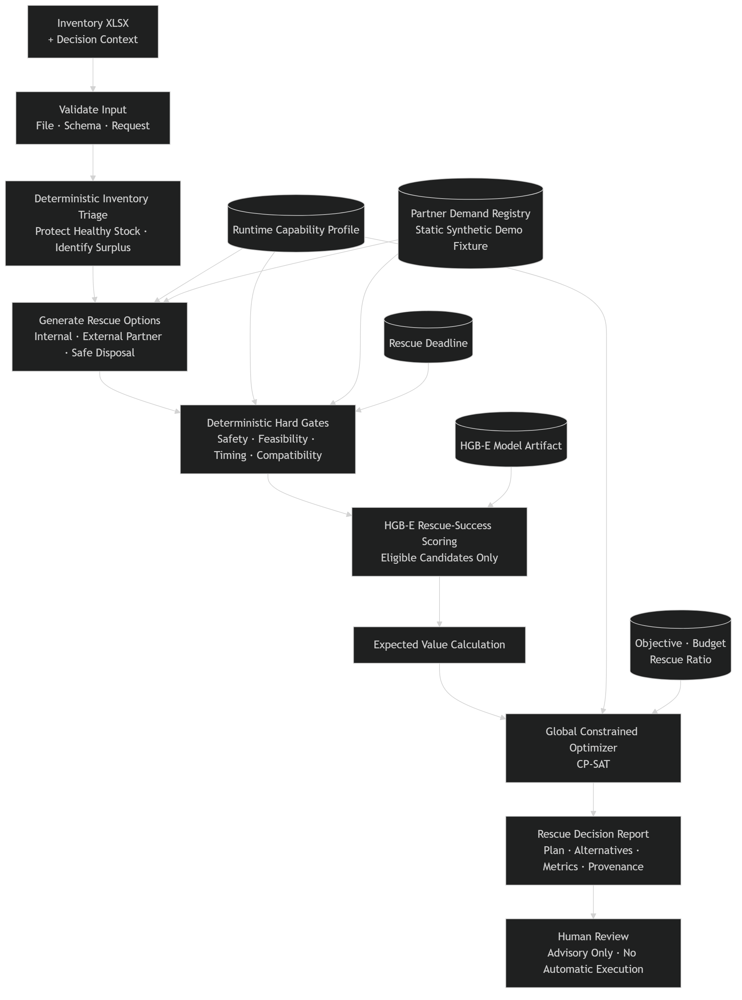

# Afterlife AI

**AI-assisted rescue planning for surplus inventory.**

Afterlife AI adalah decision-support system untuk membantu usaha retail dan F&B menentukan apa yang sebaiknya dilakukan terhadap inventori yang bergerak lambat, berlebih, mendekati akhir masa jual, atau berisiko menjadi waste.

Sistem menerima **satu workbook inventori `.xlsx`**, melindungi stok yang masih normal melalui deterministic triage, membangkitkan alternatif rescue yang didukung runtime, menolak kandidat yang unsafe atau infeasible melalui hard gates, memberi **estimated rescue-success score** pada kandidat yang masih eligible menggunakan HGB-E, menghitung expected value, lalu mengalokasikan planning quantity secara global menggunakan constrained optimization.

Output akhirnya adalah satu **Rescue Decision Report** yang tetap memerlukan human review.

```text
One XLSX
→ One Analysis
→ One Rescue Decision Report
```

Afterlife AI tidak mengeksekusi diskon, transfer, repurpose, partner allocation, disposal, atau tindakan fisik lain secara otomatis.

---

## Quick Start

The primary competition-facing application is the **FastAPI + Jinja2** interface.

### Run locally with uv

Requirements:

```text
Python 3.12
uv
```

Install the locked dependency set:

```powershell
uv sync --locked
```

Start the primary application:

```powershell
uv run uvicorn backend.main:app --host 127.0.0.1 --port 8000
```

Open:

```text
http://127.0.0.1:8000
```

Reference demo workbook:

```text
tests/fixtures/integration_001/RAW_INVENTORY_FIXTURE.xlsx
```

### Run with Docker

```powershell
docker compose up --build
```

Open the same primary interface at:

```text
http://127.0.0.1:8000
```

The reference workbook is a technical evaluation fixture, not real merchant transaction data.

---
## Why Afterlife AI

Masalah surplus inventory bukan sekadar menentukan apakah suatu barang “berlebih”.

Satu file inventori dapat mencampurkan:

- stok sehat yang tidak boleh disentuh;
- stok yang hanya perlu dimonitor;
- surplus parsial;
- barang near-expiry;
- barang expired;
- data yang tidak lengkap;
- barang yang memiliki beberapa alternatif recovery;
- kandidat yang tampak menarik secara ekonomi tetapi tidak aman atau tidak feasible.

Keputusan rescue juga saling berbagi constraint.

Satu tindakan dapat menggunakan labor, equipment, ingredient, bundle companion, cold storage, partner capacity, logistics budget, atau waktu yang juga dibutuhkan oleh kandidat lain.

Karena itu, memilih alternatif terbaik satu lot pada satu waktu belum tentu menghasilkan rencana batch yang feasible.

Afterlife AI memisahkan tanggung jawab tersebut:

```text
rules determine eligibility
model estimates rescue success
optimizer allocates constrained resources
report exposes evidence
human retains authority
```

---

## Core Decision Flow

```text
User / Browser
    |
    v
FastAPI + Jinja2 Decision Workspace
    |
    v
Application Orchestration
    |
    v
Inventory XLSX Intake
    |
    v
Structural & Semantic Validation
    |
    v
Deterministic Inventory Triage
    |
    +--> HEALTHY_STOCK
    +--> MONITOR
    +--> EXPIRED
    +--> NEEDS_REVIEW
    |
    `--> SURPLUS_CANDIDATE
             |
             v
      Planning-Lot Construction
             |
             v
      Rescue Candidate Generation
             |
             v
      Deterministic Hard Gates
             |
             +--> BLOCKED / REVIEW
             |
             `--> FEASIBLE
                     |
                     v
              HGB-E Rescue-Success Scoring
                     |
                     v
              Expected-Value Calculation
                     |
                     v
              Global CP-SAT Allocation
                     |
                     v
              Rescue Decision Report
                     |
                     v
              Human Review / Approval
```

The ordering is intentional.

A model score cannot make an unsafe candidate safe, cannot revive a blocked candidate, and cannot bypass deterministic feasibility constraints.

---

## Architecture



The simplified architecture above is intended for product and competition review.

A more detailed implementation-oriented architecture is available at:

- [`docs/architecture/ARCH-01.png`](docs/architecture/ARCH-01.png)
- [`docs/architecture/ARCHITECTURE_OVERVIEW.md`](docs/architecture/ARCHITECTURE_OVERVIEW.md)

### 1. Inventory Intake & Validation

The production path accepts one `.xlsx` workbook per request.

Canonical worksheet:

```text
inventory_lots
```

The intake layer performs workbook, worksheet, column, row, and contract validation before inventory enters the decision pipeline.

Invalid input does not proceed to model scoring or optimization.

### 2. Deterministic Inventory Triage

Triage protects normal inventory before rescue planning.

Runtime inventory outcomes include:

```text
HEALTHY_STOCK
MONITOR
SURPLUS_CANDIDATE
EXPIRED
NEEDS_REVIEW
```

Only `planning_quantity` from inventory eligible for rescue planning proceeds to candidate generation.

Review quantity and protected stock remain outside automatic rescue allocation.

### 3. Rescue Candidate Generation

The planner generates alternatives based on:

```text
runtime capability profile
domain rules
inventory condition
action support
partner evidence
available capacity
request context
```

Candidate generation does not imply feasibility.

Every candidate must still pass deterministic hard gates.

### 4. Deterministic Hard Gates

Hard gates evaluate implementation-level safety and feasibility constraints such as:

```text
runtime action support
safety
verification sufficiency
storage compatibility
timing feasibility
rescue deadline
shelf-life
action eligibility
logistics feasibility
partner-demand freshness
partner compatibility
partner capacity
domain coverage
```

A failed hard gate has authority over the model.

### 5. Rescue-Success Scoring

The selected production model is:

```yaml
label: HGB-E
family: HistGradientBoostingClassifier
model_id: M1_HIST_GRADIENT_BOOSTING
artifact: models/HGB_E_v1.joblib
```

HGB-E only scores eligible rescue candidates.

Its output is an **estimated rescue-success score** used as decision-support evidence for ranking and expected-value planning.

The score is not a field-calibrated real-world probability.

`SAFE_DISPOSAL` is treated as a terminal safety action rather than a rescue-success action and is not passed through the rescue-success model.

#### Deterministic Scoring Fallback

If the production HGB-E provider cannot be loaded because its artifact, schema, or manifest is unavailable or invalid, the production scoring layer uses a deterministic neutral fallback for candidates that already passed the hard gates:

```yaml
model_version: DETERMINISTIC_FALLBACK_V1
estimated_rescue_success_score: 0.50
```

The scoring fallback:

```text
only applies to gate-eligible candidates
does not score SAFE_DISPOSAL
cannot revive a BLOCKED candidate
cannot bypass deterministic safety or feasibility logic
does not create a real-world probability claim
```

### 6. Expected-Value Calculation

Eligible candidates are translated into decision-value components before global allocation.

The reporting layer separates economic and physical quantities instead of mixing them into one ambiguous score.

Examples include:

```text
expected cash recovery
expected future branch recovery
expected avoided purchase cost
expected total economic value

expected physical rescue quantity
expected waste quantity
expected rescue ratio

expected inventory loss
expired inventory loss

logistics budget used
shared-resource capacity utilization
BALANCED rescue-floor status
```

These are decision-support estimates derived from runtime input, configured parameters, deterministic rules, candidate economics, model estimates, and optimizer results.

They are not realized merchant outcomes.

### 7. Global Allocation Optimization

Primary optimizer:

```text
OR-Tools CP-SAT
```

Allocation is performed globally across the batch instead of choosing each lot independently.

Applicable constraints include:

```text
planning quantity conservation
candidate eligibility
candidate minimum order quantity
action-level capacity
partner / destination capacity
generic shared resource capacity
request-level logistics budget
optimization objective
optional minimum expected rescue ratio
```

Generic shared capacities may represent resources such as:

```text
labor_hours
equipment_units
ingredient_units
bundle_companion_units
cold_storage_units
```

The optimizer may therefore reject an individually attractive candidate when allocating it would violate a batch-level resource constraint.

### 8. Optimizer Fallback

CP-SAT remains the primary planner.

A deterministic fallback is reserved for documented non-definitive solver outcomes where applicable constraints can still be preserved.

Fallback must preserve:

```text
hard-gate eligibility
quantity constraints
minimum order quantity
shared capacities
generic resource capacities
request constraints
```

A definitive:

```text
INFEASIBLE
```

result is **not** converted into a successful fallback allocation.

When the constrained problem is infeasible:

```text
selected rescue allocation = none
planning quantity = unallocated
solver status = INFEASIBLE
human exception review = required
```

### 9. Rescue Decision Report

The final report exposes the evidence behind the recommendation.

It includes information such as:

```text
request identity
analysis timestamp
input provenance
triage results
selected allocations
unselected alternatives
rejection / reason codes
allocated quantity
unallocated quantity
economic-value components
physical rescue and waste estimates
scoring provenance
feature-schema version
ruleset version
runtime capability version
partner-registry provenance
optimizer status
resource utilization
fallback information
warnings
limitations
manual-review items
human approval status
```

The report can be downloaded from the primary UI as JSON.

Reports are not persisted in a runtime database.

---

## Supported Runtime Rescue Actions

The domain contracts define a broader rescue-action vocabulary, but the active Technical MVP intentionally enables a narrower production profile.

The current runtime operationalizes:

```text
INTERNAL_REPURPOSE
BUNDLE
LOCAL_DISCOUNT
EXTERNAL_PARTNER
SAFE_DISPOSAL
```

Availability is still conditional.

An enabled action is not automatically feasible for every inventory lot.

Candidate generation, compatibility, timing, capacity, demand, safety, resource, and optimizer constraints still apply.

---

## Partner Demand Registry

`EXTERNAL_PARTNER` candidates use a controlled Partner Demand Registry.

Current Technical MVP registry:

```yaml
mode: static
runtime_internet: false
source: synthetic demo fixture
real_world_verified: false
```

The registry can provide controlled evidence such as:

```text
partner identity
active demand
available capacity
maximum quantity
minimum order quantity
offered price
estimated completion time
distance
compatibility
demand validity
```

This demonstrates partner-demand-aware planning.

It is **not**:

```text
a live marketplace
real-time buyer demand
verified partner commitments
internet-connected partner discovery
```

---

## Decision Context

One analysis request may include:

```text
optimization_objective
max_logistics_budget
minimum_expected_rescue_ratio
rescue_deadline_at
```

Supported objectives:

```text
MAXIMIZE_RECOVERY_VALUE
MINIMIZE_WASTE
BALANCED
```

`rescue_deadline_at` may affect timing feasibility.

`max_logistics_budget` constrains allocation rather than treating every positive logistics cost as infeasible.

`minimum_expected_rescue_ratio` is used where required by the `BALANCED` objective.

Optimization policy never overrides deterministic safety or feasibility decisions.

---

## Where AI Is Used

Afterlife AI intentionally does not force machine learning into every stage.

```text
Validation          → deterministic
Triage              → deterministic
Candidate creation  → deterministic
Safety gates        → deterministic
Feasibility gates   → deterministic
Rescue-success      → HGB-E model
Expected value      → deterministic calculation
Allocation          → CP-SAT optimization
Reporting           → deterministic
Final approval      → human
```

The AI component answers a narrow question:

> Among candidates that are already allowed and feasible, which candidates have stronger estimated rescue-success evidence?

This separation prevents model confidence from being mistaken for safety authority.

---

## Model Evaluation

### Synthetic Benchmark

Training and evaluation use a controlled synthetic benchmark.

Canonical benchmark structure:

```yaml
candidate_rows: 12020
scenario_groups: 2400
split_unit: scenario_group_id

train_groups: 1680
validation_groups: 360
test_groups: 360

group_leakage: false
test_policy: LOCKED_FINAL_EVALUATION
```

Scenario-group splitting prevents candidates from the same synthetic scenario group from being distributed across train and evaluation partitions.

Model selection was frozen before locked final-test access.

### Selected Model vs B1 Baseline

Locked synthetic final-test evidence:

| Metric | HGB-E | B1 action-prior baseline |
|---|---:|---:|
| PR-AUC | **0.874229** | 0.834923 |
| Brier score ↓ | **0.151383** | 0.156801 |
| MRR | **0.930093** | 0.915972 |
| NDCG@3 | **0.890749** | 0.869309 |
| Top-1 success rate | **0.872222** | 0.844444 |
| Pairwise accuracy | **0.663004** | 0.596337 |

Downstream synthetic allocation diagnostics recorded:

```yaml
HGB_E:
  mean_allocation_regret: 9454.805111
  oracle_value_retained: 0.998591

B1:
  mean_allocation_regret: 20545.045250
  oracle_value_retained: 0.996938
```

The registered AI Value Gate also passed across the recorded robustness evaluation.

These results support the claim that HGB-E improves over the B1 baseline **on the frozen synthetic benchmark**.

They do not establish field accuracy or real-world rescue probability calibration.

---

## Synthetic Data Artifacts

Frozen synthetic artifacts are included in the repository for inspection and reproducibility.

```text
data/
├── generated/
│   ├── synthetic_candidates_v2.csv
│   └── synthetic_oracle_v2.csv
│
└── processed/
    ├── synthetic_dataset_manifest_v2.json
    └── synthetic_split_manifest_v2.csv
```

Generation configuration:

```text
configs/synthetic_dataset_v2.yaml
```

Additional frozen evaluation evidence is available under:

```text
reports/evidence/synthetic_dataset/
reports/evidence/modeling/
```

Synthetic data is used to evaluate the technical mechanism under controlled scenarios.

It should not be interpreted as representative statistics for Indonesian merchants or as evidence of real-world business impact.

---

## Primary Interface

The primary competition-facing presentation layer is:

```text
FastAPI + Jinja2 + HTML + CSS + vanilla JavaScript
```

The interface provides:

```text
XLSX upload
decision-context controls
validation feedback
triage summary
selected allocations
alternative candidates
warnings
manual-review items
model provenance
optimizer provenance
limitations
JSON report download
```

Frontend code does not duplicate triage, gate, scoring, optimizer, or report business logic.

It calls the same canonical application pipeline used by the production backend.

Visual and interface references:

- [`BRAND_GUIDELINES.md`](BRAND_GUIDELINES.md)
- [`DESIGN.md`](DESIGN.md)

---

## Streamlit Challenger

A Streamlit presentation layer is retained as a thin challenger/reference implementation.

Run it with:

```powershell
uv run streamlit run streamlit_app.py
```

The Streamlit implementation reuses the same:

```text
validation
triage
candidate generation
hard gates
scoring
optimization
reporting
```

It does not contain a second copy of business logic.

After a controlled comparison, FastAPI + Jinja2 was retained as the primary interface because it provides stronger presentation hierarchy and clearer competition-facing explanation of hard gates, alternatives, provenance, limitations, and human authority.

Comparison evidence:

```text
docs/frontend_comparison/
```

---

## Technology Stack

```yaml
language: Python 3.12
package_manager: uv

api:
  - FastAPI
  - Uvicorn
validation: Pydantic v2

spreadsheet:
  - openpyxl
  - pandas

machine_learning:
  - scikit-learn
  - joblib
optimization: OR-Tools CP-SAT

primary_frontend:
  - Jinja2
  - HTML
  - CSS
  - vanilla JavaScript
challenger_frontend:
  - Streamlit

testing: pytest
linting: Ruff
type_checking: mypy

containerization:
  - Docker
  - Docker Compose

runtime_database: none
runtime_internet_dependency: none
```

---

## Quick Start with Docker

Docker Compose is the recommended reproduction path.

### Requirements

```text
Docker Desktop
or
Docker Engine + Docker Compose
```

### Start

```powershell
docker compose up --build
```

Open:

```text
http://127.0.0.1:8000
```

Health endpoint:

```text
http://127.0.0.1:8000/health
```

FastAPI documentation:

```text
http://127.0.0.1:8000/docs
```

### Stop

```powershell
docker compose down
```

The core runtime is local-first and does not require a runtime database or internet-connected business service.

---

## Local Development

### Requirements

```text
Python 3.12
uv
```

Install the locked dependency set:

```powershell
uv sync --locked
```

Start the primary application:

```powershell
uv run uvicorn backend.main:app --host 127.0.0.1 --port 8000
```

Open:

```text
http://127.0.0.1:8000
```

Reference demo workbook:

```text
tests/fixtures/integration_001/RAW_INVENTORY_FIXTURE.xlsx
```

The fixture is a technical evaluation fixture, not real merchant transaction data.

---

## HTTP Interface

### `GET /`

Renders the Afterlife AI decision workspace.

### `GET /health`

Expected response:

```json
{
  "status": "ok",
  "service": "afterlife-ai"
}
```

### `POST /api/analyze`

Multipart form fields:

```text
inventory_file
optimization_objective
max_logistics_budget
minimum_expected_rescue_ratio
rescue_deadline_at
```

Example request semantics:

```text
inventory_file=<one .xlsx file>

optimization_objective=
  MAXIMIZE_RECOVERY_VALUE
  | MINIMIZE_WASTE
  | BALANCED

max_logistics_budget=
  optional non-negative decimal

minimum_expected_rescue_ratio=
  objective-dependent value from 0 to 1

rescue_deadline_at=
  optional timezone-aware datetime
```

The request is processed synchronously and returns one `RescueDecisionReport`.

Current upload limit:

```text
10 MB
```

Uploads are handled through temporary storage and removed after request processing.

Current controlled error behavior includes:

```text
wrong file extension -> HTTP 400
empty upload         -> HTTP 400
corrupt XLSX         -> HTTP 422
invalid workbook     -> HTTP 422 with validation detail
invalid request context -> HTTP 422
```

Unexpected internal failures remain server errors and are not presented as successful analysis results.

---

## Verification

The aligned production runtime has a recorded local verification checkpoint with:

```yaml
contract_alignment: PASS
runtime_verification: PASS

full_regression:
  tests_passed: 372
  failed: 0

ruff: PASS
mypy: PASS
frontend_javascript_syntax: PASS
git_diff_check: PASS

docker_clean_build: PASS
docker_compose_startup: PASS
container_health: PASS

GET_health: 200
GET_root: 200

canonical_xlsx_e2e: PASS
report_render: PASS
report_download: PASS

working_tree_after_verification: CLEAN
```

The same verification recorded:

```yaml
quantity_conservation: PASS
hard_constraint_violations: 0
```

The runtime was considered locally ready for code freeze after post-audit contract reconciliation.

These values describe the recorded aligned runtime checkpoint.

Final submission reproducibility must still be executed against the exact frozen submission commit before the repository is represented as fully submission-ready.

### Developer Checks

Full regression:

```powershell
uv run pytest -q
```

Lint:

```powershell
uv run ruff check src backend tests scripts
```

Type checking:

```powershell
uv run mypy src backend frontend
```

Frontend JavaScript syntax:

```powershell
node --check frontend/static/js/app.js
```

Git whitespace integrity:

```powershell
git diff --check
```

---

## Repository Structure

```text
Afterlife-AI/
├── .streamlit/
│   └── config.toml
│
├── backend/
│   ├── api/
│   │   └── routes.py
│   └── main.py
│
├── configs/
│   ├── runtime_v1.yaml
│   ├── partner_registry_demo_v1.yaml
│   ├── selected_model_v1.yaml
│   ├── synthetic_dataset_v2.yaml
│   └── ...
│
├── data/
│   ├── generated/
│   │   ├── synthetic_candidates_v2.csv
│   │   └── synthetic_oracle_v2.csv
│   └── processed/
│       ├── synthetic_dataset_manifest_v2.json
│       └── synthetic_split_manifest_v2.csv
│
├── docs/
│   ├── architecture/
│   ├── contracts/
│   ├── evaluation_source_v1.0/
│   ├── frontend_comparison/
│   └── submission/
│
├── frontend/
│   ├── static/
│   ├── streamlit/
│   └── templates/
│
├── models/
│   └── HGB_E_v1.joblib
│
├── notebooks/
│   ├── Afterlife_AI_Model_Evaluation_Visualization_Google_COLAB.ipynb
│   └── Afterlife_AI_Model_Evaluation_Visualization_PORTABLE_LOCAL.ipynb
│
├── reports/
│   ├── evidence/
│   └── figures/
│
├── scripts/
│
├── src/
│   └── afterlife_ai/
│       ├── contracts/
│       ├── evaluation/
│       ├── intake/
│       ├── integration/
│       ├── modeling/
│       ├── pipeline/
│       ├── planner/
│       ├── scoring/
│       ├── synthetic/
│       └── triage/
│
├── tests/
│   ├── acceptance/
│   ├── api/
│   ├── evaluation/
│   ├── fixtures/
│   ├── integration/
│   └── unit/
│
├── streamlit_app.py
├── Dockerfile
├── compose.yaml
├── pyproject.toml
├── uv.lock
├── BRAND_GUIDELINES.md
├── DESIGN.md
└── README.md
```

---

## Evidence Map

The repository intentionally preserves implementation and evaluation evidence rather than reducing the project to a single headline metric.

Start here:

```text
reports/evidence/SUBMISSION_EVIDENCE_INDEX.md
```

Important evidence areas:

### Model and AI Value

```text
reports/evidence/modeling/
```

Includes:

```text
model selection
AI Value Gate
robustness evaluation
baseline comparison
allocation-regret diagnostics
locked final-test evidence
selected model manifest
```

### Synthetic Benchmark

```text
reports/evidence/synthetic_dataset/
```

Includes:

```text
dataset manifest
quality audit
grouped split evidence
benchmark freeze record
generator reuse audit
```

### Planner and Optimization

```text
reports/evidence/rescue_planner/
```

Includes evidence for:

```text
planner acceptance
quantity conservation
candidate behavior
solver behavior
fallback behavior
Rescue Decision Report
```

### Runtime / Release Evidence

```text
reports/evidence/
docs/submission/
```

Includes:

```text
Technical MVP verification
contract alignment
claim boundary
architecture interpretation
submission evidence mapping
```

---

## Contract and Governance References

Canonical implementation-facing references include:

```text
docs/contracts/FEATURE_SCHEMA_FINAL_v2.0.yaml
docs/contracts/BASELINE_CONTRACT_v1.0.md
docs/contracts/TRIAGE_EVALUATION_SUITE_v1.0.md

docs/evaluation_source_v1.0/domain_rules_v1.0.yaml
docs/evaluation_source_v1.0/evaluation_spec_v1.0.yaml

configs/runtime_v1.yaml
configs/partner_registry_demo_v1.yaml
configs/selected_model_v1.yaml

docs/submission/PREPRODUCTION_CONTRACT_ALIGNMENT.md
docs/submission/FINAL_CLAIM_BOUNDARY.md
```

Locked preproduction contracts remain historical source-of-truth records.

Where production semantics required a narrower or safer refinement, the difference is recorded explicitly rather than silently rewriting the original contract.

Executable tests remain part of the implementation source of truth.

---

## Safety and Human Governance

Afterlife AI is advisory.

The final report preserves:

```yaml
human_final_approval_status: PENDING
execution_performed: false
```

The system does not automatically perform:

```text
discount execution
inventory transfer
product transformation
partner transaction
donation
disposal
pickup
delivery
logistics execution
```

Human decision authority remains outside automatic execution.

---

## Runtime Boundary

The current Technical MVP is intentionally:

```yaml
execution: local-first
processing: synchronous
database: none
server_side_report_history: none
runtime_internet_dependency: none
automatic_execution: none
```

This scope follows the competition requirement to prioritize one working core interaction instead of adding surrounding platform infrastructure.

---

## Known Limitations

The current implementation does not establish:

```text
field-calibrated rescue probabilities
real-world merchant predictive performance
verified waste reduction percentages
verified revenue improvement
real-world partner commitments
live marketplace operation
real-time demand synchronization
commercial adoption
willingness-to-pay validation
optimizer superiority over greedy
production multi-user deployment
```

Additional limitations include:

```text
training and benchmark data are synthetic
runtime business parameters are static demo defaults
partner registry is synthetic and offline
no authentication
no persistent database
no report history
no background jobs
no automatic retraining
no online learning
no automatic physical execution
```

These boundaries are intentional.

A technically functioning decision mechanism should not be presented as field validation it has not yet earned.

---

## Non-Goals

The competition Technical MVP intentionally excludes:

```text
full ERP implementation
advanced analytics dashboard
complex authentication
persistent user history
distributed database
background processing
OCR pipeline
live partner marketplace
automatic negotiation
WhatsApp / email automation
real-time logistics tracking
automatic transaction execution
automatic retraining
closed-loop learning
multi-agent orchestration
cloud-dependent core runtime
```

---

## Project Status

Canonical runtime alignment currently records:

```yaml
preproduction_contract_alignment:
  ALIGNED_WITH_RECORDED_SEMANTIC_REFINEMENT

blocking_safety_contradiction: false
runtime_verification: PASS
local_code_freeze_ready: true

production_follow_up_required: []

final_release_audit: PASS
technical_repository_frozen: true
submission_ready: false
```

`submission_ready: false` does not indicate an unresolved production-runtime blocker.

The technical repository has now passed the G10 final release audit and is frozen for recording and submission packaging.

`submission_ready` remains separate because competition deliverables outside the technical repository may still be pending.

---

## Competition Context

Afterlife AI is developed for:

**COMPFEST 18 — AI Innovation Challenge**

The project aligns most directly with the competition's **Smart Commerce** area and also overlaps with **Smart Logistics** through inventory movement, capacity, and allocation decisions.

The rulebook defines both as competition areas; the wording above describes this project's fit rather than a separate official track assignment.

The repository follows the competition Technical MVP boundary:

```text
single core input
synchronous backend
core AI inference
local reproducibility
Docker Compose
no unnecessary surrounding platform
```

The competition submission additionally requires external deliverables such as proof-of-work video, promotional video, and proposal.

Those deliverables are tracked separately from production runtime readiness.

---

## Claim Boundary

Supported:

> Afterlife AI combines deterministic inventory triage, deterministic safety and feasibility gates, learned rescue-success scoring, expected-value calculation, constrained global allocation, and human-reviewed advisory reporting.

Supported:

> HGB-E demonstrates measurable improvement over the B1 action-prior baseline on the frozen synthetic benchmark.

Supported:

> The MVP uses constrained global optimization to allocate planning quantity across feasible rescue candidates.

Supported:

> External-partner matching is demonstrated using a static synthetic Partner Demand Registry fixture.

Not supported:

```text
validated real-world rescue probability
verified real-world waste reduction
verified merchant revenue improvement
live partner marketplace
autonomous physical rescue
optimizer proven superior to greedy
production enterprise deployment
nationally representative merchant data
```

The complete canonical claim register is maintained in:

[`docs/submission/FINAL_CLAIM_BOUNDARY.md`](docs/submission/FINAL_CLAIM_BOUNDARY.md)

---

## Final Principle

Afterlife AI separates the parts of the decision that should not be delegated to a predictive model from the part where learned ranking can add value.

```text
Protect healthy stock.
Reject unsafe or infeasible actions.
Estimate rescue success only where prediction is allowed.
Allocate scarce resources globally.
Expose the evidence.
Keep the final decision human.
```
