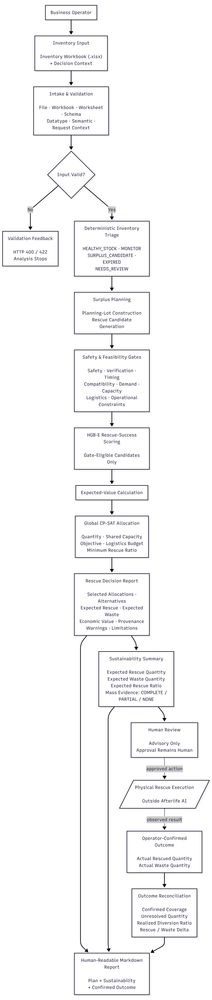
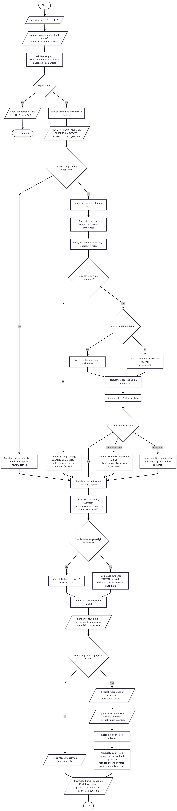

# Afterlife AI

**AI-assisted surplus rescue planning with measurable sustainability outcome reconciliation.**

Afterlife AI is a decision-support system that helps retail and F&B businesses determine what to do with slow-moving, excess, near-end-of-sale-life inventory or inventory at risk of becoming waste.

The system accepts **one `.xlsx` inventory workbook**, protects normal stock through deterministic triage, generates runtime-supported rescue alternatives, rejects unsafe or infeasible candidates through hard gates, assigns an **estimated rescue-success score** to eligible candidates using HGB-E, calculates expected value, and globally allocates planning quantity through constrained optimization.

The primary output remains a **Rescue Decision Report** that requires human review. For NextStep Hacks 2026, the production web flow also produces a typed **Sustainability Summary** and provides **operator-confirmed Outcome Reconciliation** to compare plan-derived impact with outcomes that have actually been confirmed.

```text
One XLSX
→ One Analysis
→ Rescue Decision Report
→ Sustainability Summary
→ Operator-confirmed Outcome Reconciliation
```

Afterlife AI does not automatically execute discounts, transfers, repurposing, partner allocations, disposal, or any other physical action.

**Live app:** https://afterlife-ai-xi.vercel.app/

**NextStep implementation record:** [`docs/nextstep/NEXTSTEP_2026_DELTA.md`](docs/nextstep/NEXTSTEP_2026_DELTA.md)

---

---

## Why Afterlife AI

Surplus inventory is not simply a matter of deciding whether an item is “excess.”

A single inventory file can contain:

- healthy stock that must not be touched;
- stock that only needs monitoring;
- partial surplus;
- near-expiry items;
- expired items;
- incomplete data;
- items with multiple recovery alternatives;
- candidates that appear economically attractive but are unsafe or infeasible.

Rescue decisions also share constraints.

A single action may consume labor, equipment, ingredients, bundle companion stock, cold storage, partner capacity, logistics budget, or time that other candidates also need.

Therefore, choosing the best alternative one lot at a time does not necessarily produce a feasible batch plan.

Afterlife AI separates these responsibilities:

```text
rules determine eligibility
model estimates rescue success
optimizer allocates constrained resources
report exposes evidence
human retains authority
```

---

---

## What it does

- Accepts one inventory `.xlsx` workbook plus request-level decision context.
- Validates workbook structure, schema, rows, and decision context before any model scoring or optimization.
- Protects healthy inventory and isolates only the quantity that is eligible for rescue planning through deterministic triage.
- Generates rescue alternatives from the active runtime capability profile, domain rules, internal actions, external-partner evidence, and safe-disposal logic.
- Applies deterministic hard gates for safety, verification, compatibility, timing, demand, capacity, storage, logistics, and supported-domain coverage.
- Scores only gate-eligible rescue candidates with the HGB-E rescue-success model.
- Calculates expected economic value and physical rescue/waste quantities without treating estimates as realized outcomes.
- Allocates planning quantity globally with OR-Tools CP-SAT under quantity, shared-resource, partner-capacity, logistics-budget, and objective constraints.
- Produces a Rescue Decision Report with selected allocations, rejected alternatives, provenance, warnings, limitations, and manual-review items.
- Produces a typed Sustainability Summary with expected rescue/waste quantities, rescue ratio, and evidence-bounded mass metrics.
- Reconciles operator-confirmed rescued and wasted quantities against the expected planning scope without mutating or persisting the original rescue plan.
- Exports a human-readable Markdown report while keeping typed JSON available through the application APIs.
- Keeps physical execution and final approval outside automation.

---

---

## NextStep Hacks 2026 Extension

Pre-hackathon baseline:

```text
nextstep-prehackathon-baseline-2026-08-30
```

The pre-existing rescue engine is preserved. During NextStep, Afterlife AI was extended with a measurable sustainability layer rather than replacing the HGB-E model, deterministic triage, hard gates, expected-value logic, or CP-SAT optimizer.

New NextStep capabilities:

```text
typed Sustainability Summary
expected rescue / waste quantity reconciliation
COMPLETE / PARTIAL / NONE mass-evidence coverage
mass-based rescue / waste estimates only when weight evidence is complete
stateless operator-confirmed Outcome Reconciliation
realized diversion ratio from confirmed outcomes only
explicit unresolved quantity
expected-vs-realized rescue and waste deltas
human-readable Markdown report export
```

Expected/model-derived impact is kept separate from realized/operator-confirmed impact. Missing package weight is never imputed, partial weight coverage is never presented as a complete batch-mass claim, and outcome observations are not persisted by this demo.

Implementation and acceptance details:

- [`docs/nextstep/NEXTSTEP_2026_DELTA.md`](docs/nextstep/NEXTSTEP_2026_DELTA.md)

Live production application:

```text
https://afterlife-ai-xi.vercel.app/
```

---

---

## Quick Start

The primary competition-facing application is the **FastAPI + Jinja2** interface.

### Run locally with uv

Requirements:

```text
Python 3.12
uv
```

Install the locked dependency set:

```powershell
uv sync --locked
```

Start the primary application:

```powershell
uv run uvicorn backend.main:app --host 127.0.0.1 --port 8000
```

Open:

```text
http://127.0.0.1:8000
```

Reference demo workbook:

```text
tests/fixtures/integration_001/RAW_INVENTORY_FIXTURE.xlsx
```

### Run with Docker

```powershell
docker compose up --build
```

Open the same primary interface at:

```text
http://127.0.0.1:8000
```

The reference workbook is a technical evaluation fixture, not real merchant transaction data.

---

---

## Core Reasoning Flow



The end-to-end view follows the complete decision lifecycle from inventory input and request context through validation, deterministic triage, rescue-option construction, hard-gate eligibility, HGB-E scoring, expected-value calculation, constrained global allocation, advisory reporting, sustainability measurement, operator-confirmed outcome reconciliation, and the final human authority boundary. The important separation is preserved throughout: deterministic rules decide what is allowed, the model estimates rescue success only where prediction is permitted, the optimizer allocates constrained resources, and observed outcomes remain distinct from plan-derived expectations.



The operational flowchart shows the runtime decision path in more procedural form: validate the request, route inventory through triage states, construct and gate candidates, score only eligible rescue actions, solve the constrained allocation problem, produce the report and impact summary, reconcile confirmed outcomes when supplied, surface unresolved or review-required states, and stop before automatic physical execution.

---

---

## Architecture


The simplified final architecture is the judge-facing view. It keeps the system's core responsibility boundaries visible without exposing every supporting implementation artifact: input and validation, deterministic inventory reasoning, rescue planning and hard gates, learned rescue-success scoring, expected-value calculation, constrained allocation, reporting and impact measurement, and human review.


The full final architecture expands the same system into its implementation-oriented components and runtime boundaries. It is the more appropriate reference when inspecting how the FastAPI/Jinja2 interface, canonical application pipeline, runtime configuration, model artifact, partner evidence, optimization layer, sustainability reporting, outcome reconciliation, and advisory human-authority boundary fit together.

Additional architecture interpretation:

- [`docs/architecture/ARCHITECTURE_OVERVIEW.md`](docs/architecture/ARCHITECTURE_OVERVIEW.md)

### 1. Inventory Intake & Validation

The production path accepts one `.xlsx` workbook per request.

Canonical worksheet:

```text
inventory_lots
```

The intake layer performs workbook, worksheet, column, row, and contract validation before inventory enters the decision pipeline.

Invalid input does not proceed to model scoring or optimization.

Demand-signal or analytical workbooks that do not implement the
`inventory_lots` contract are supporting data artifacts, not direct
`/api/analyze-nextstep` or legacy `/api/analyze` inputs, and are expected to be rejected with validation detail.

### 2. Deterministic Inventory Triage

Triage protects normal inventory before rescue planning.

Runtime inventory outcomes include:

```text
HEALTHY_STOCK
MONITOR
SURPLUS_CANDIDATE
EXPIRED
NEEDS_REVIEW
```

Only `planning_quantity` from inventory eligible for rescue planning proceeds to candidate generation.

Review quantity and protected stock remain outside automatic rescue allocation.

### 3. Rescue Candidate Generation

The planner generates alternatives based on:

```text
runtime capability profile
domain rules
inventory condition
action support
partner evidence
available capacity
request context
```

Candidate generation does not imply feasibility.

Every candidate must still pass deterministic hard gates.

### 4. Deterministic Hard Gates

Hard gates evaluate implementation-level safety and feasibility constraints such as:

```text
runtime action support
safety
verification sufficiency
storage compatibility
timing feasibility
rescue deadline
shelf-life
action eligibility
logistics feasibility
partner-demand freshness
partner compatibility
partner capacity
domain coverage
```

A failed hard gate has authority over the model.

### 5. Rescue-Success Scoring

The selected production model is:

```yaml
label: HGB-E
family: HistGradientBoostingClassifier
model_id: M1_HIST_GRADIENT_BOOSTING
artifact: models/HGB_E_v1.joblib
```

HGB-E only scores eligible rescue candidates.

Its output is an **estimated rescue-success score** used as decision-support evidence for ranking and expected-value planning.

The score is not a field-calibrated real-world probability.

`SAFE_DISPOSAL` is treated as a terminal safety action rather than a rescue-success action and is not passed through the rescue-success model.

#### Deterministic Scoring Fallback

If the production HGB-E provider cannot be loaded because its artifact, schema, or manifest is unavailable or invalid, the production scoring layer uses a deterministic neutral fallback for candidates that already passed the hard gates:

```yaml
model_version: DETERMINISTIC_FALLBACK_V1
estimated_rescue_success_score: 0.50
```

The scoring fallback:

```text
only applies to gate-eligible candidates
does not score SAFE_DISPOSAL
cannot revive a BLOCKED candidate
cannot bypass deterministic safety or feasibility logic
does not create a real-world probability claim
```

### 6. Expected-Value Calculation

Eligible candidates are translated into decision-value components before global allocation.

The reporting layer separates economic and physical quantities instead of mixing them into one ambiguous score.

Examples include:

```text
expected cash recovery
expected future branch recovery
expected avoided purchase cost
expected total economic value

expected physical rescue quantity
expected waste quantity
expected rescue ratio

expected inventory loss
expired inventory loss

logistics budget used
shared-resource capacity utilization
BALANCED rescue-floor status
```

These are decision-support estimates derived from runtime input, configured parameters, deterministic rules, candidate economics, model estimates, and optimizer results.

They are not realized merchant outcomes.

### 7. Global Allocation Optimization

Primary optimizer:

```text
OR-Tools CP-SAT
```

Allocation is performed globally across the batch instead of choosing each lot independently.

Applicable constraints include:

```text
planning quantity conservation
candidate eligibility
candidate minimum order quantity
action-level capacity
partner / destination capacity
generic shared resource capacity
request-level logistics budget
optimization objective
optional minimum expected rescue ratio
```

Generic shared capacities may represent resources such as:

```text
labor_hours
equipment_units
ingredient_units
bundle_companion_units
cold_storage_units
```

The optimizer may therefore reject an individually attractive candidate when allocating it would violate a batch-level resource constraint.

### 8. Optimizer Fallback

CP-SAT remains the primary planner.

A deterministic fallback is reserved for documented non-definitive solver outcomes where applicable constraints can still be preserved.

Fallback must preserve:

```text
hard-gate eligibility
quantity constraints
minimum order quantity
shared capacities
generic resource capacities
request constraints
```

A definitive:

```text
INFEASIBLE
```

result is **not** converted into a successful fallback allocation.

When the constrained problem is infeasible:

```text
selected rescue allocation = none
planning quantity = unallocated
solver status = INFEASIBLE
human exception review = required
```

### 9. Rescue Decision Report

The final report exposes the evidence behind the recommendation.

It includes information such as:

```text
request identity
analysis timestamp
input provenance
triage results
selected allocations
unselected alternatives
rejection / reason codes
allocated quantity
unallocated quantity
economic-value components
physical rescue and waste estimates
scoring provenance
feature-schema version
ruleset version
runtime capability version
partner-registry provenance
optimizer status
resource utilization
fallback information
warnings
limitations
manual-review items
human approval status
```

The report can be downloaded from the primary UI as a human-readable Markdown file. The application APIs continue to expose typed JSON responses for programmatic use.

Reports are not persisted in a runtime database.

---

---

## Supported Runtime Rescue Actions

The domain contracts define a broader rescue-action vocabulary, but the active Technical MVP intentionally enables a narrower production profile.

The current runtime operationalizes:

```text
INTERNAL_REPURPOSE
BUNDLE
LOCAL_DISCOUNT
EXTERNAL_PARTNER
SAFE_DISPOSAL
```

Availability is still conditional.

An enabled action is not automatically feasible for every inventory lot.

Candidate generation, compatibility, timing, capacity, demand, safety, resource, and optimizer constraints still apply.

---

---

## Partner Demand Registry

`EXTERNAL_PARTNER` candidates use a controlled Partner Demand Registry.

Current Technical MVP registry:

```yaml
mode: static
runtime_internet: false
source: synthetic demo fixture
real_world_verified: false
```

The registry can provide controlled evidence such as:

```text
partner identity
active demand
available capacity
maximum quantity
minimum order quantity
offered price
estimated completion time
distance
compatibility
demand validity
```

This demonstrates partner-demand-aware planning.

It is **not**:

```text
a live marketplace
real-time buyer demand
verified partner commitments
internet-connected partner discovery
```

---

---

## Decision Context

One analysis request may include:

```text
optimization_objective
max_logistics_budget
minimum_expected_rescue_ratio
rescue_deadline_at
```

Supported objectives:

```text
MAXIMIZE_RECOVERY_VALUE
MINIMIZE_WASTE
BALANCED
```

`rescue_deadline_at` may affect timing feasibility.

`max_logistics_budget` constrains allocation rather than treating every positive logistics cost as infeasible.

`minimum_expected_rescue_ratio` is used where required by the `BALANCED` objective.

Optimization policy never overrides deterministic safety or feasibility decisions.

---

---

## Where AI Is Used

Afterlife AI intentionally does not force machine learning into every stage.

```text
Validation          → deterministic
Triage              → deterministic
Candidate creation  → deterministic
Safety gates        → deterministic
Feasibility gates   → deterministic
Rescue-success      → HGB-E model
Expected value      → deterministic calculation
Allocation          → CP-SAT optimization
Reporting           → deterministic
Final approval      → human
```

The AI component answers a narrow question:

> Among candidates that are already allowed and feasible, which candidates have stronger estimated rescue-success evidence?

This separation prevents model confidence from being mistaken for safety authority.

---

---

## Model Evaluation

### Synthetic Benchmark

Training and evaluation use a controlled synthetic benchmark.

Canonical benchmark structure:

```yaml
candidate_rows: 12020
scenario_groups: 2400
split_unit: scenario_group_id

train_groups: 1680
validation_groups: 360
test_groups: 360

group_leakage: false
test_policy: LOCKED_FINAL_EVALUATION
```

Scenario-group splitting prevents candidates from the same synthetic scenario group from being distributed across train and evaluation partitions.

Model selection was frozen before locked final-test access.

### Selected Model vs B1 Baseline

Locked synthetic final-test evidence:

| Metric | HGB-E | B1 action-prior baseline |
|---|---:|---:|
| PR-AUC | **0.874229** | 0.834923 |
| Brier score ↓ | **0.151383** | 0.156801 |
| MRR | **0.930093** | 0.915972 |
| NDCG@3 | **0.890749** | 0.869309 |
| Top-1 success rate | **0.872222** | 0.844444 |
| Pairwise accuracy | **0.663004** | 0.596337 |

Downstream synthetic allocation diagnostics recorded:

```yaml
HGB_E:
  mean_allocation_regret: 9454.805111
  oracle_value_retained: 0.998591

B1:
  mean_allocation_regret: 20545.045250
  oracle_value_retained: 0.996938
```

The registered AI Value Gate also passed across the recorded robustness evaluation.

These results support the claim that HGB-E improves over the B1 baseline **on the frozen synthetic benchmark**.

They do not establish field accuracy or real-world rescue probability calibration.

---

---

## Synthetic Data Artifacts

Frozen synthetic artifacts are included in the repository for inspection and reproducibility.

```text
data/
├── generated/
│   ├── synthetic_candidates_v2.csv
│   └── synthetic_oracle_v2.csv
│
└── processed/
    ├── synthetic_dataset_manifest_v2.json
    └── synthetic_split_manifest_v2.csv
```

Generation configuration:

```text
configs/synthetic_dataset_v2.yaml
```

Additional frozen evaluation evidence is available under:

```text
reports/evidence/synthetic_dataset/
reports/evidence/modeling/
```

Synthetic data is used to evaluate the technical mechanism under controlled scenarios.

It should not be interpreted as representative statistics for Indonesian merchants or as evidence of real-world business impact.

---

---

## Primary Interface

The primary competition-facing presentation layer is:

```text
FastAPI + Jinja2 + HTML + CSS + vanilla JavaScript
```

The interface provides:

```text
XLSX upload
decision-context controls
validation feedback
triage summary
selected allocations
alternative candidates
expected sustainability summary
mass-evidence coverage
operator-confirmed outcome reconciliation
realized diversion ratio and unresolved quantity
warnings
manual-review items
model provenance
optimizer provenance
limitations
Markdown report download
```

Frontend code does not duplicate triage, gate, scoring, optimizer, or report business logic.

It calls the same canonical application pipeline used by the production backend.

Visual and interface references:

- [`BRAND_GUIDELINES.md`](BRAND_GUIDELINES.md)
- [`DESIGN.md`](DESIGN.md)

---

---

## Technology Stack

```yaml
language: Python 3.12
package_manager: uv

api:
  - FastAPI
  - Uvicorn
validation: Pydantic v2

spreadsheet:
  - openpyxl
  - pandas

machine_learning:
  - scikit-learn
  - joblib
optimization: OR-Tools CP-SAT

primary_frontend:
  - Jinja2
  - HTML
  - CSS
  - vanilla JavaScript
challenger_frontend:
  - Streamlit

testing: pytest
linting: Ruff
type_checking: mypy

containerization:
  - Docker
  - Docker Compose

runtime_database: none
runtime_internet_dependency: none
```

---

---

## Local Development

### Requirements

```text
Python 3.12
uv
```

Install the locked dependency set:

```powershell
uv sync --locked
```

Start the primary application:

```powershell
uv run uvicorn backend.main:app --host 127.0.0.1 --port 8000
```

Open:

```text
http://127.0.0.1:8000
```

Reference demo workbook:

```text
tests/fixtures/integration_001/RAW_INVENTORY_FIXTURE.xlsx
```

The fixture is a technical evaluation fixture, not real merchant transaction data.

---

---

## Quick Start with Docker

Docker Compose is the recommended reproduction path.

### Requirements

```text
Docker Desktop
or
Docker Engine + Docker Compose
```

### Start

```powershell
docker compose up --build
```

Open:

```text
http://127.0.0.1:8000
```

Health endpoint:

```text
http://127.0.0.1:8000/health
```

FastAPI documentation:

```text
http://127.0.0.1:8000/docs
```

### Stop

```powershell
docker compose down
```

The core runtime is local-first and does not require a runtime database or internet-connected business service.

---

---

## HTTP Interface

### `GET /`

Renders the Afterlife AI decision workspace.

### `GET /health`

Expected response:

```json
{
  "status": "ok",
  "service": "afterlife-ai"
}
```

### `POST /api/analyze`

Multipart form fields:

```text
inventory_file
optimization_objective
max_logistics_budget
minimum_expected_rescue_ratio
rescue_deadline_at
```

Example request semantics:

```text
inventory_file=<one .xlsx file>

optimization_objective=
  MAXIMIZE_RECOVERY_VALUE
  | MINIMIZE_WASTE
  | BALANCED

max_logistics_budget=
  optional non-negative decimal

minimum_expected_rescue_ratio=
  objective-dependent value from 0 to 1

rescue_deadline_at=
  optional timezone-aware datetime
```

The request is processed synchronously and returns one `RescueDecisionReport`.

Current upload limit:

```text
10 MB
```

Uploads are handled through temporary storage and removed after request processing.

Current controlled error behavior includes:

```text
wrong file extension -> HTTP 400
empty upload         -> HTTP 400
corrupt XLSX         -> HTTP 422
invalid workbook     -> HTTP 422 with validation detail
invalid request context -> HTTP 422
```

Unexpected internal failures remain server errors and are not presented as successful analysis results.

### `POST /api/analyze-nextstep`

Uses the same multipart analysis request fields as the legacy analysis route and returns the NextStep report envelope:

```text
rescue_decision_report
sustainability_summary
```

The canonical browser analysis flow uses this endpoint so the UI receives rescue-planning output and typed sustainability output together. The legacy `/api/analyze` route remains available with its original direct `RescueDecisionReport` response shape.

### `POST /api/outcomes/reconcile`

Accepts an operator-confirmed outcome observation against the expected planning scope and returns realized reconciliation metrics, including confirmed rescued quantity, confirmed waste quantity, unresolved quantity, realized diversion ratio when computable, and expected-vs-realized deltas.

This endpoint is stateless. It does not persist the observation and does not mutate the original rescue plan.

---

---

## Streamlit Challenger

A Streamlit presentation layer is retained as a thin challenger/reference implementation.

Run it with:

```powershell
uv run streamlit run streamlit_app.py
```

The Streamlit implementation reuses the same:

```text
validation
triage
candidate generation
hard gates
scoring
optimization
reporting
```

It does not contain a second copy of business logic.

After a controlled comparison, FastAPI + Jinja2 was retained as the primary interface because it provides stronger presentation hierarchy and clearer competition-facing explanation of hard gates, alternatives, provenance, limitations, and human authority.

Comparison evidence:

```text
docs/frontend_comparison/
```

---

---

## Verification

### Current NextStep regression checkpoint

The current `main`-equivalent tree has been rerun locally with the final NextStep implementation and final diagram commit present:

```yaml
full_regression:
  tests_passed: 419
  failed: 0

ruff_full_repository: PASS
frontend_javascript_syntax:
  app.js: PASS
  impact-ui.js: PASS
  report-markdown.js: PASS

working_tree: CLEAN
local_tree_matches_origin_main: true
```

This checkpoint verifies the current repository regression state. It does not replace separate deployed-app smoke verification.

### Earlier aligned runtime checkpoint

The aligned production runtime also has an earlier recorded local verification checkpoint with:

```yaml
contract_alignment: PASS
runtime_verification: PASS

full_regression:
  tests_passed: 375
  failed: 0

ruff: PASS
mypy: PASS
frontend_javascript_syntax: PASS
git_diff_check: PASS

docker_clean_build: PASS
docker_compose_startup: PASS
container_health: PASS

GET_health: 200
GET_root: 200

canonical_xlsx_e2e: PASS
report_render: PASS
report_download: PASS

realistic_inventory_workbooks:
  warung_75: PASS
  minimarket_180: PASS
  distributor_1500: PASS

working_tree_after_verification: CLEAN
```

The same earlier verification recorded:

```yaml
quantity_conservation: PASS
hard_constraint_violations: 0
```

These earlier values describe the recorded aligned runtime checkpoint and should not be mistaken for a fresh rerun of every Docker/live-smoke item against the current NextStep commit.

Final submission reproducibility still requires the deployed production URL to pass the XLSX → analysis → outcome reconciliation → Markdown download smoke path before the exact submission commit is frozen.

### Developer Checks

Full regression:

```powershell
uv run python -m pytest -q
```

Lint:

```powershell
uv run ruff check .
```

Type checking:

```powershell
uv run mypy src backend frontend
```

Frontend JavaScript syntax:

```powershell
node --check frontend/static/js/app.js
node --check frontend/static/js/impact-ui.js
node --check frontend/static/js/report-markdown.js
```

Git whitespace integrity:

```powershell
git diff --check
```

---

---

## Repository Structure

```text
Afterlife-AI/
├── .streamlit/
│   └── config.toml
│
├── backend/
│   ├── api/
│   │   └── routes.py
│   └── main.py
│
├── configs/
│   ├── runtime_v1.yaml
│   ├── partner_registry_demo_v1.yaml
│   ├── selected_model_v1.yaml
│   ├── synthetic_dataset_v2.yaml
│   └── ...
│
├── data/
│   ├── generated/
│   │   ├── synthetic_candidates_v2.csv
│   │   └── synthetic_oracle_v2.csv
│   └── processed/
│       ├── synthetic_dataset_manifest_v2.json
│       └── synthetic_split_manifest_v2.csv
│
├── docs/
│   ├── architecture/
│   ├── contracts/
│   ├── evaluation_source_v1.0/
│   ├── frontend_comparison/
│   ├── nextstep/
│   └── submission/
│
├── frontend/
│   ├── static/
│   ├── streamlit/
│   └── templates/
│
├── models/
│   └── HGB_E_v1.joblib
│
├── notebooks/
│   ├── Afterlife_AI_Model_Evaluation_Visualization_Google_COLAB.ipynb
│   └── Afterlife_AI_Model_Evaluation_Visualization_PORTABLE_LOCAL.ipynb
│
├── reports/
│   ├── evidence/
│   └── figures/
│
├── scripts/
│
├── src/
│   └── afterlife_ai/
│       ├── contracts/
│       ├── evaluation/
│       ├── impact/
│       ├── intake/
│       ├── integration/
│       ├── modeling/
│       ├── pipeline/
│       ├── planner/
│       ├── scoring/
│       ├── synthetic/
│       └── triage/
│
├── tests/
│   ├── acceptance/
│   ├── api/
│   ├── evaluation/
│   ├── fixtures/
│   ├── integration/
│   └── unit/
│
├── streamlit_app.py
├── Dockerfile
├── compose.yaml
├── pyproject.toml
├── uv.lock
├── BRAND_GUIDELINES.md
├── DESIGN.md
└── README.md
```

---

---

## Evidence Map

The repository intentionally preserves implementation and evaluation evidence rather than reducing the project to a single headline metric.

Start here:

```text
reports/evidence/SUBMISSION_EVIDENCE_INDEX.md
```

Important evidence areas:

### Model and AI Value

```text
reports/evidence/modeling/
```

Includes:

```text
model selection
AI Value Gate
robustness evaluation
baseline comparison
allocation-regret diagnostics
locked final-test evidence
selected model manifest
```

### Synthetic Benchmark

```text
reports/evidence/synthetic_dataset/
```

Includes:

```text
dataset manifest
quality audit
grouped split evidence
benchmark freeze record
generator reuse audit
```

### Planner and Optimization

```text
reports/evidence/rescue_planner/
```

Includes evidence for:

```text
planner acceptance
quantity conservation
candidate behavior
solver behavior
fallback behavior
Rescue Decision Report
```

### Runtime / Release Evidence

```text
reports/evidence/
docs/submission/
```

Includes:

```text
Technical MVP verification
contract alignment
claim boundary
architecture interpretation
submission evidence mapping
```

---

---

## Documentation

Key implementation, evaluation, and submission-facing references:

- [`docs/nextstep/NEXTSTEP_2026_DELTA.md`](docs/nextstep/NEXTSTEP_2026_DELTA.md) — NextStep baseline, implementation delta, invariants, and acceptance suite.
- [`docs/architecture/E2E-DIAGRAM.png`](docs/architecture/E2E-DIAGRAM.png) — end-to-end rescue, impact, and outcome lifecycle.
- [`docs/architecture/FLOWCHART.png`](docs/architecture/FLOWCHART.png) — operational decision flow.
- [`docs/architecture/ARCH%20SIMPLE%20FINAL.png`](docs/architecture/ARCH%20SIMPLE%20FINAL.png) — simplified judge-facing final architecture.
- [`docs/architecture/ARCH%20FULL%20FINAL.png`](docs/architecture/ARCH%20FULL%20FINAL.png) — detailed implementation-oriented final architecture.
- [`docs/submission/FINAL_CLAIM_BOUNDARY.md`](docs/submission/FINAL_CLAIM_BOUNDARY.md) — supported and unsupported claim boundary.
- [`reports/evidence/SUBMISSION_EVIDENCE_INDEX.md`](reports/evidence/SUBMISSION_EVIDENCE_INDEX.md) — technical evidence index.
- [`BRAND_GUIDELINES.md`](BRAND_GUIDELINES.md) — visual and communication system.
- [`DESIGN.md`](DESIGN.md) — primary interface design specification.

Historical AIC submission evidence remains preserved in the repository and should not be read as a claim that the NextStep sustainability and outcome-reconciliation layer existed before the recorded NextStep baseline.

---

---

## Contract and Governance References

Canonical implementation-facing references include:

```text
docs/contracts/FEATURE_SCHEMA_FINAL_v2.0.yaml
docs/contracts/BASELINE_CONTRACT_v1.0.md
docs/contracts/TRIAGE_EVALUATION_SUITE_v1.0.md

docs/evaluation_source_v1.0/domain_rules_v1.0.yaml
docs/evaluation_source_v1.0/evaluation_spec_v1.0.yaml

configs/runtime_v1.yaml
configs/partner_registry_demo_v1.yaml
configs/selected_model_v1.yaml

docs/submission/PREPRODUCTION_CONTRACT_ALIGNMENT.md
docs/submission/FINAL_CLAIM_BOUNDARY.md
```

Locked preproduction contracts remain historical source-of-truth records.

Where production semantics required a narrower or safer refinement, the difference is recorded explicitly rather than silently rewriting the original contract.

Executable tests remain part of the implementation source of truth.

---

---

## Safety and Human Governance

Afterlife AI is advisory.

The final report preserves:

```yaml
human_final_approval_status: PENDING
execution_performed: false
```

The system does not automatically perform:

```text
discount execution
inventory transfer
product transformation
partner transaction
donation
disposal
pickup
delivery
logistics execution
```

Human decision authority remains outside automatic execution.

---

---

## Runtime Boundary

The current Technical MVP is intentionally:

```yaml
execution: local-first
processing: synchronous
database: none
server_side_report_history: none
runtime_internet_dependency: none
automatic_execution: none
```

This scope follows the competition requirement to prioritize one working core interaction instead of adding surrounding platform infrastructure.

---

---

## Known Limitations

The current implementation does not establish:

```text
field-calibrated rescue probabilities
real-world merchant predictive performance
verified waste reduction percentages
verified revenue improvement
real-world partner commitments
live marketplace operation
real-time demand synchronization
commercial adoption
willingness-to-pay validation
optimizer superiority over greedy
production multi-user deployment
```

Additional limitations include:

```text
training and benchmark data are synthetic
runtime business parameters are static demo defaults
partner registry is synthetic and offline
no authentication
no persistent database
no report history
no background jobs
no automatic retraining
no online learning
no automatic physical execution
```

These boundaries are intentional.

A technically functioning decision mechanism should not be presented as field validation it has not yet earned.

---

---

## Non-Goals

The competition Technical MVP intentionally excludes:

```text
full ERP implementation
advanced analytics dashboard
complex authentication
persistent user history
distributed database
background processing
OCR pipeline
live partner marketplace
automatic negotiation
WhatsApp / email automation
real-time logistics tracking
automatic transaction execution
automatic retraining
closed-loop learning
multi-agent orchestration
cloud-dependent core runtime
```

---

---

## Project Status

Current NextStep repository state:

```yaml
core_rescue_runtime: PASS
nextstep_sustainability_extension: IMPLEMENTED
outcome_reconciliation: IMPLEMENTED
markdown_report_export: IMPLEMENTED

final_regression:
  tests_passed: 419
  failed: 0

ruff_full_repository: PASS
frontend_javascript_syntax: PASS
local_tree_matches_origin_main: true

documentation_alignment: IN_PROGRESS
deployed_full_smoke: PENDING
submission_freeze: PENDING
submission_ready: false
```

The current blockers are submission-alignment work rather than an unresolved core-runtime defect. Historical COMPFEST/AIC release and freeze records remain preserved under `docs/submission/` and `reports/evidence/`; they describe the earlier competition checkpoint, not the final NextStep submission state.

---

---

## Competition Context

### Current: NextStep Hacks 2026

Afterlife AI's current competition build is the NextStep Hacks 2026 extension recorded against the pre-hackathon baseline tag:

```text
nextstep-prehackathon-baseline-2026-08-30
```

The NextStep delta adds measurable sustainability reporting and operator-confirmed outcome reconciliation while preserving the pre-existing rescue engine and its claim boundaries.

### Historical origin: COMPFEST 18 — AI Innovation Challenge

Afterlife AI was originally developed for **COMPFEST 18 — AI Innovation Challenge**.

The project aligned most directly with the competition's **Smart Commerce** area and also overlapped with **Smart Logistics** through inventory movement, capacity, and allocation decisions.

The rulebook defined both as competition areas; the wording above describes this project's fit rather than a separate official track assignment.

The earlier repository followed the COMPFEST Technical MVP boundary:

```text
single core input
synchronous backend
core AI inference
local reproducibility
Docker Compose
no unnecessary surrounding platform
```

Historical COMPFEST deliverables such as proof-of-work video, promotional video, and proposal remain separate from the current NextStep submission package.

---

---

## Claim Boundary

Supported:

> Afterlife AI combines deterministic inventory triage, deterministic safety and feasibility gates, learned rescue-success scoring, expected-value calculation, constrained global allocation, and human-reviewed advisory reporting.

Supported:

> HGB-E demonstrates measurable improvement over the B1 action-prior baseline on the frozen synthetic benchmark.

Supported:

> The MVP uses constrained global optimization to allocate planning quantity across feasible rescue candidates.

Supported:

> External-partner matching is demonstrated using a static synthetic Partner Demand Registry fixture.

Supported for the NextStep extension:

> Afterlife AI derives expected rescue/waste impact from the canonical rescue-planning result and can reconcile that expectation against operator-confirmed rescued and wasted quantities without presenting expected impact as realized impact.

Not supported:

```text
validated real-world rescue probability
verified real-world waste reduction
verified merchant revenue improvement
live partner marketplace
autonomous physical rescue
optimizer proven superior to greedy
production enterprise deployment
nationally representative merchant data
```

The complete canonical claim register is maintained in:

[`docs/submission/FINAL_CLAIM_BOUNDARY.md`](docs/submission/FINAL_CLAIM_BOUNDARY.md)

---

---

## Final Principle

Afterlife AI separates the parts of the decision that should not be delegated to a predictive model from the part where learned ranking can add value.

```text
Protect healthy stock.
Reject unsafe or infeasible actions.
Estimate rescue success only where prediction is allowed.
Allocate scarce resources globally.
Measure expected impact without pretending it already happened.
Reconcile confirmed outcomes without rewriting the original plan.
Expose the evidence.
Keep the final decision human.
```
